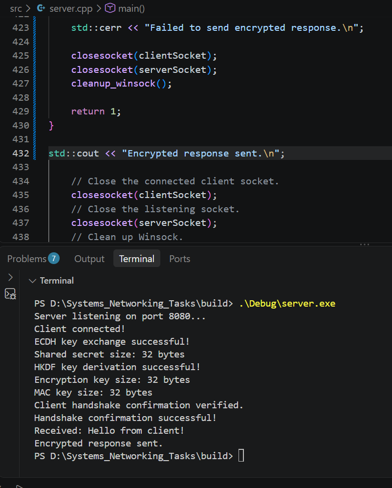
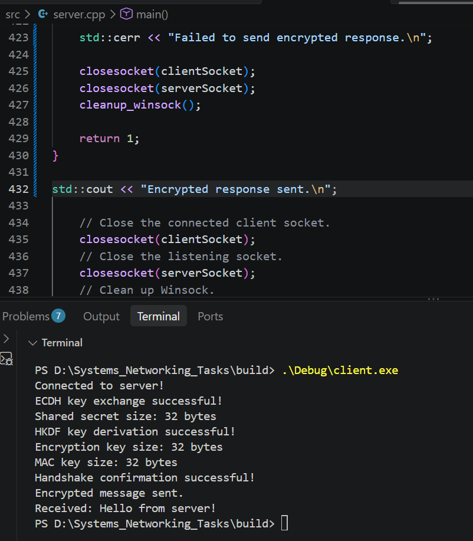

# Networking - TLS-Inspired Encrypted Chat

## Level 1 - Basic TCP Communication

### Implemented

- raw TCP client server model
- message framing with type bytes=[1], length field=[2] and payload=[length field] bytes

### Length field bytes

It could have fixed sizeslike 1, 2, 4 etc. as cstdint library is able to resolve them. If a size like 3 bytes would be used the it would unnecessarily make implementation complex.

### Challenges faced in Level 1

- CMake errors were coming up after initial implementation but the problem was incorrect CMake commands, so learnt them first
- I couldn't understand how client and server were connecting, so searched about it and got that the OS manages the TCP connection using the functions in code

### Architecture

```text
Client                         Server

socket()                       socket()
   |                              |
connect() --------------------> bind()
                                  |
                               listen()
                                  |
                               accept()
                                  |
send() ----------------------> recv()
   |                              |
recv() <---------------------- send()
   |                              |
close()                       closesocket()
```


## Level 2 - Diffie-Hellman Key Exchange

### Understanding
Diffie-Hellman (DH) allows two parties to establish a shared secret over an insecure channel without directly transmitting the secret.Elliptic-Curve Diffie-Hellman (ECDH) provides the same key-agreement functionality using elliptic-curve cryptography. The major advantage of ECDH is that it provides greater security with shorter key size.
For this implementation, I used X25519, a modern elliptic-curve key-agreement scheme based on Curve25519.
Each side generates a private/public key pair. The public key is exchanged over the TCP connection while the private key remains local. Each side then uses its private key and the peer's public key to independently compute the same shared secret.

### Implemented

- X25519 key pair generation
- Public key extraction
- Public key exchange using the custom framing protocol
- Shared secret generation using X25519


## Level 3

### Understanding

A KDF takes the shared secret established through DH/ECDH and derives separate keys for different purposes, such as an encryption key and a MAC key. Since both sender and receiver have the same shared secret and use the same KDF specified by the protocol, they independently derive the same keys.

#### HKDF - HMAC-based Key Derivation Function

HKDF is a two-stage key derivation construction. 
1. Extract: The input key material, which is the X25519 shared secret in this case, is processed using HMAC to produce a pseudorandom key (PRK).
2. Expand: The PRK is combined with context information (info) to derive the required key material.
This implementation uses HKDF-SHA256.

## Level 4

### Understanding
In this level, Handshake confirmation by both parties was implemented by sending a transcript along with MAC over the channel. Both parties computed the MAC independently and checked against received MACs to verify the if handshake has been performed correctly.

### Design
1. Transcript - ordered concatenation of the client and server X25519 public keys
2. HMAC SHA-256 - Each side independently computes HMAC(MAC key, transcript) to generate a 32 byte long output

## Level 5

### Understanding
In this level, encrypted and authenticated messaging was implemented using AES-256-CBC and HMAC-SHA256.
AES-256-CBC is used to encrypt the chat message using the encryption key derived during Level 3. A fresh 16-byte IV (Initialization Vector) is generated for every message. The IV does not need to be secret and is sent along with the encrypted message.
After encryption, HMAC-SHA256 is calculated over the IV and ciphertext using the separately derived MAC key. The receiver first verifies the HMAC and only decrypts the message if the MAC is valid. This ensures that any modification to the IV or ciphertext is detected before the message is accepted.

### Design
1. Encryption - AES-256-CBC is used with the encryption key and a randomly generated 16-byte IV.
2. Authentication - HMAC-SHA256 is calculated over IV || ciphertext using the MAC key.
3. Message format - The encrypted payload is sent as:
   IV || ciphertext || MAC
4. Verification - The receiver independently calculates the HMAC and compares it with the received MAC before decrypting.
5. Decryption - If the MAC matches, AES-256-CBC is used to recover the original plaintext.




